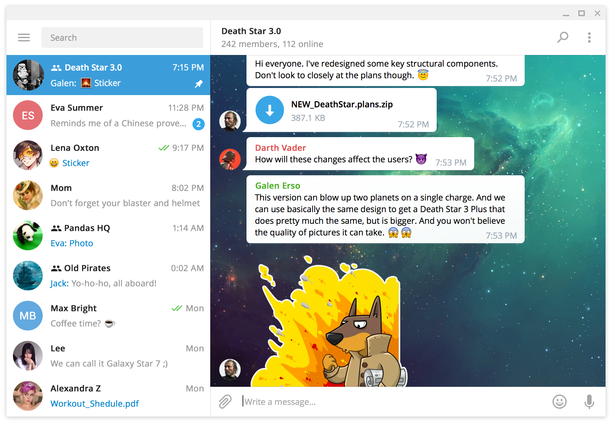
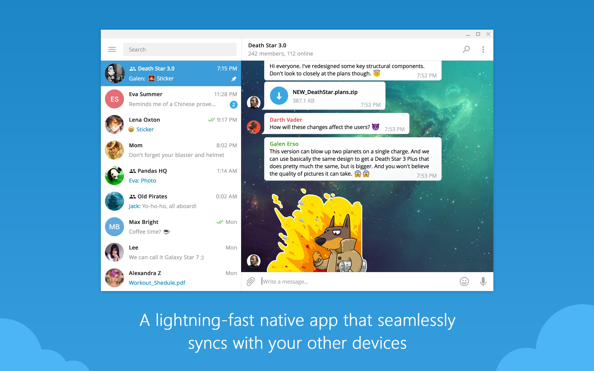
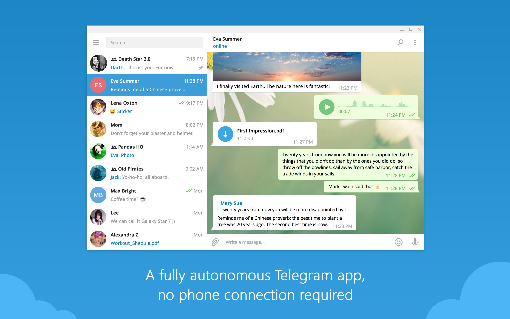
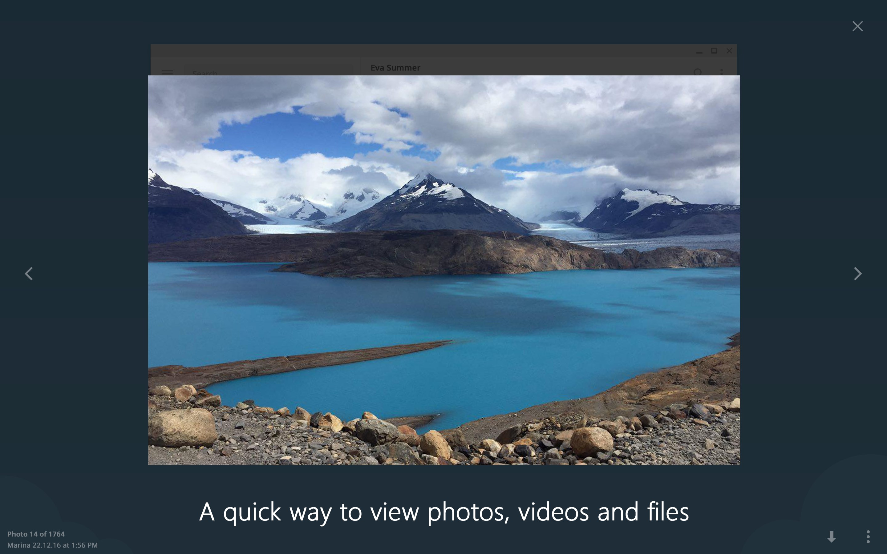
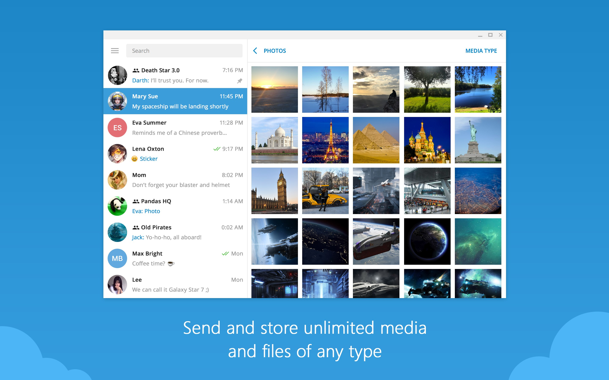

# Astrogram Desktop

  

  Telegram Desktop, rebuilt as Astrogram: branded desktop client, native plugins, local runtime API and extra power-user settings.

  
  
  
  

## What is Astrogram

Astrogram is a desktop Telegram client based on Telegram Desktop with an extended Astrogram layer on top. The project focuses on a cleaner branded client, deeper customization, a native plugin system, local runtime integration and a dedicated Astrogram settings hub.

## Core Areas

### Client

- Astrogram branding across executable name, icons, metadata and docs.
- Dedicated Astrogram settings entry inside the client.
- Extra desktop-focused quality-of-life features, privacy tools and interface tweaks.
- Windows target shipped as `Astrogram.exe`.

### Plugins

- Native `.tgd` plugin format.
- In-app plugin manager with safe mode, diagnostics logs and recovery flow.
- Plugin examples and catalog-oriented repository structure.
- Runtime-aware plugin architecture for future integrations.

### Runtime API

- Local runtime surface for automation, diagnostics and external tooling.
- Designed for desktop-side integrations instead of cloud dependence.
- Documented together with the plugin system and Astrogram tooling.

## Community

- Documentation: [docs.astrogram.su](https://docs.astrogram.su)
- Channel: [@astrogramchannel](https://t.me/astrogramchannel)
- Chat: [@astrogram_chat](https://t.me/astrogram_chat)

## Screenshots

| Main Window | Dialogs |
| --- | --- |
|  |  |
|  |  |

## Repository Layout

- `Telegram/` - Astrogram desktop client source tree.
- `Telegram/Plugins/Examples/` - example `.tgd` plugins.
- `.github/workflows/` - desktop, plugin and site CI.
- `site/docs/` - documentation site source.
- `docs/` - build docs and static assets.

## Build

- Windows x64: [docs/building-win-x64.md](docs/building-win-x64.md)
- Windows x86: [docs/building-win.md](docs/building-win.md)
- macOS: [docs/building-mac.md](docs/building-mac.md)
- Linux: [docs/building-linux.md](docs/building-linux.md)

## License and Upstream

Astrogram is built on top of Telegram Desktop and keeps the same GPLv3 plus OpenSSL exception licensing model used by the upstream project. See [LICENSE](LICENSE) and [LEGAL](LEGAL).

## Project Status

- Main delivery target: Windows desktop build published as `Astrogram.exe`.
- GitHub Actions includes cached dependencies and a fast compile precheck before long Windows builds.
- Client, plugin system, runtime API and docs are developed in the same repository.

Thanks ❤️ Telegram Desktop, AyuGram Desktop, exteraGram, Kotatogram, 64Gram, Forkgram.
