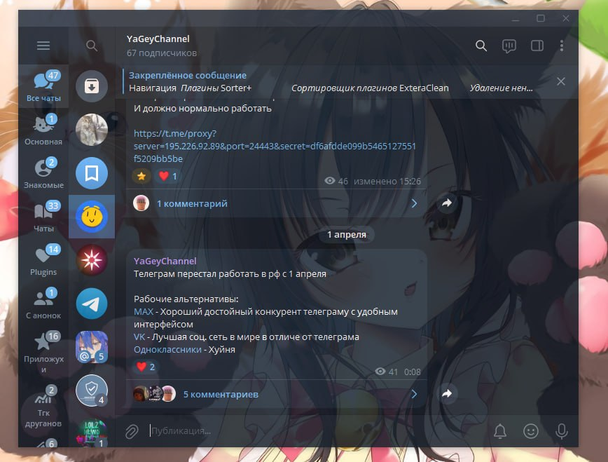

<h1>Astrogram Desktop</h1>

  

  Astrogram — десктопный Telegram-клиент с нативной системой плагинов.

  
  
  
  
  
  

 ## Что такое Astrogram 

- Astrogram — форк Telegram Desktop с упором на приватность, кастомизацию и расширяемость. В клиенте реализовано настолько много нового: система плагинов и runtime API для управления клиентом и сессией, множество настроек интерфейса/приватности, даже локальный премимум и ещё многое и многое внутри. 
 

 ## Поподробнее про плагины 

- Они могут менять внешний вид окон, перехватывать команды в чатах, добавлять собственные настройки с ползунками и переключателями, работать с сессией и окнами Astrogram, обращаться к внешним сервисам. Управляется всё через встроенный менеджер в настройках. Плагины пишутся на C++.  
 

 ## Сообщество

- Канал: [@astrogramchannel](https://t.me/astrogramchannel) 
- Чат: [@astrogram_chat](https://t.me/astrogram_chat) 
  

 ## Как писать плагины? 

- Вот документация: [docs.astrogram.su](https://docs.astrogram.su) 

 ## Лицензия

- GPLv3 с OpenSSL exception. Подробности в [LICENSE](LICENSE) и [LEGAL](LEGAL). 

Отдельное спасибо ❤️ AyuGram, exteraGram, Kotatogram, 64Gram, Forkgram 
